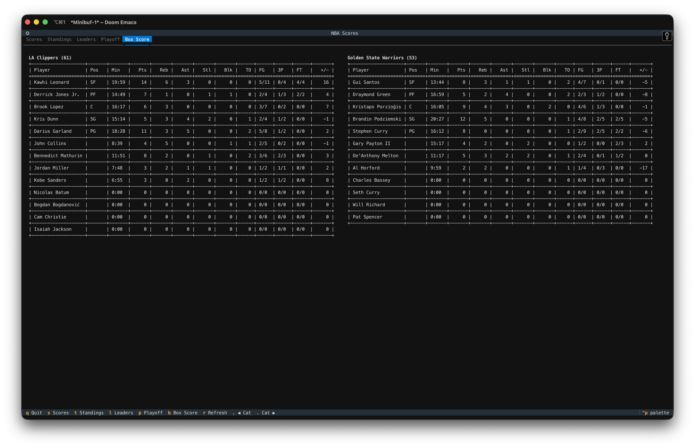

# NBA



NBA is a Python package that provides a command-line interface to current NBA
scores, standings, statistical leaders, playoff picture, and live box scores.
It supports both a static one-shot mode and an interactive TUI with
auto-refresh.

# Table of Contents

- [Installation](#installation)
- [Usage](#usage)
  - [Interactive TUI](#interactive-tui)
  - [Static output](#static-output)
- [Contributing](#contributing)

# Installation

[Back to top](#table-of-contents)

```shell
git clone https://git.cleberg.net/nba-scores.git
cd nba-scores
pipx install .
```

# Usage

[Back to top](#table-of-contents)

## Interactive TUI

Launch the full interactive terminal UI:

```shell
nba --tui
```

Optional flags:

| Flag               | Description                                            |
|--------------------|--------------------------------------------------------|
| `--tui`            | Launch the interactive TUI                             |
| `--scores`         | Open TUI on the Scores tab (default)                   |
| `--standings`      | Open TUI on the Standings tab                          |
| `--refresh N`      | Auto-refresh interval in seconds (default: 60, min: 10)|

### TUI tabs

| Tab             | Key | Description                                              |
|-----------------|-----|----------------------------------------------------------|
| Scores          | `s` | Today's games with live scores and status                |
| Standings       | `t` | East / West conference standings, side by side           |
| Leaders         | `l` | Top 25 players by stat category                          |
| Playoff Picture | `p` | Conference seeding with clinch and elimination status    |
| Box Score       | `b` | Per-player live stats for a selected game                |

### TUI key bindings

| Key     | Action                                         |
|---------|------------------------------------------------|
| `1`–`9` | Load box score for game N from the Scores tab  |
| `,`     | Cycle to the previous leaders stat category    |
| `.`     | Cycle to the next leaders stat category        |
| `r`     | Refresh all data immediately                   |
| `q`     | Quit                                           |

### Leaders stat categories

Cycles through: Points, Rebounds, Assists, Steals, Blocks, Efficiency, FG%, FT%, 3P%

## Static output

Print scores or standings directly to the terminal without launching the TUI:

| Argument      | Shortcut | Description                       |
|---------------|----------|-----------------------------------|
| `--scores`    | `-sc`    | Print today's scoreboard          |
| `--standings` | `-st`    | Print current conference standings|

```shell
nba --scores
nba --standings
```

# Contributing

[Back to top](#table-of-contents)

Any and all contributions are welcome. Feel free to fork the project,
add features, and submit a pull request.
